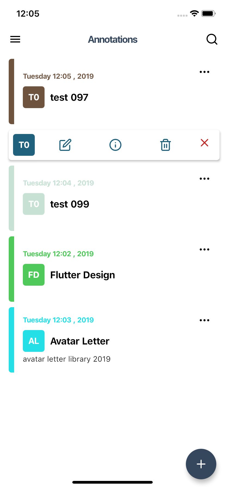

# AvatarLetter

It is a widget that uses the first few letters of a word to create an avatar with a set of basic functions.

## Preview


## PageView


## Getting Started

Add the plugin:

```yaml
dependencies:
  ...
  avatar_letter: ^1.0.1
```

# Basic Usage

```dart
    AvatarLetter(
                  size: 200,
                  backgroundColor: Colors.amber,
                  textColor: Colors.black,
                  fontSize: 100,
                  upperCase: true,
                  numberLetters: 1,
                  letterType: LetterType.Circular,
                  text: 'Test 01',
                ),
   ```
   
   ## Customization (Optional)

### AvatarLetter
**letterType** - Sets the format of the avatar that can be: (Rectangle, circular, none). Default to Rectangle<br/>
**text** - The text that will be used to extract the letters. Default to '?'<br/>
**textColor** - Sets the color of the letters. Default to Black<br/>
**textColorHex** - Sets the color of the letters from a valid hexadecimal code. Default to #ffffff<br/>
**backgroundColor** - Represents the background color of the avatar. Default to Black <br/>
**backgroundColorHex** -  Represents the background color of the avatar from a valid hexadecimal code. Default to #000000<br/>
**numberLetters** - Sets the number of letters to be extracted from the text. Default to 1 <br/>
**fontWeight** - Sets the font style. Default to Bold  <br/>
**fontFamily** - Sets the font .
**fontSize** - Sets the size of the letters within the avatar. Default to 16<br/>
**upperCase** - Used to set the uppercase letters of the avatar. Default to False <br/>
**size** - Sets the size of the avatar. Default to 50 <br/>
